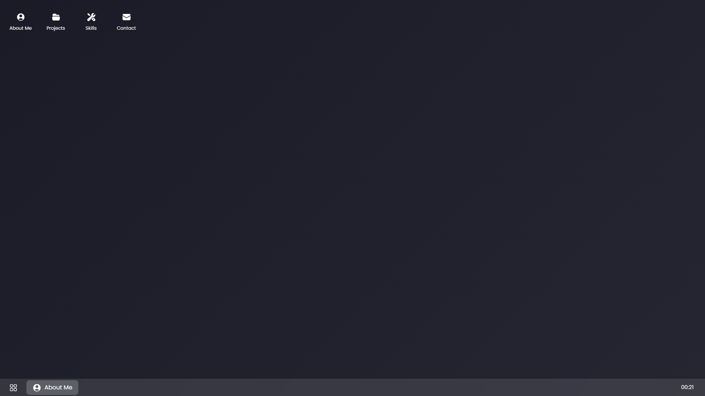
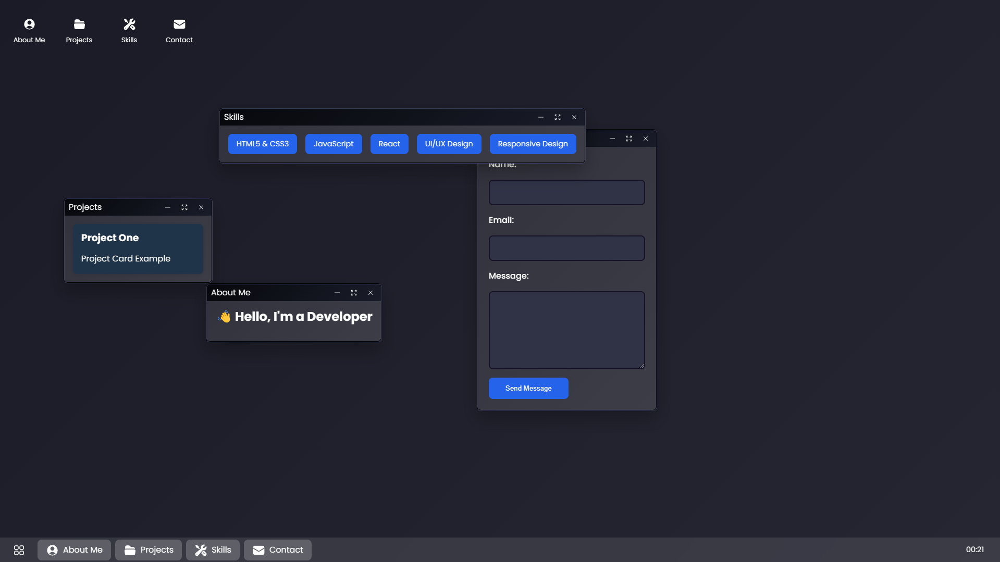

# Desktop Portfolio Documentation (Work in Progress)

A modern, interactive desktop-like portfolio website built with React and GSAP, featuring a Windows-like interface with draggable windows, taskbar, and context menus. **Note: This project is still a work in progress.**

## Table of Contents

- [Overview](#overview)
- [Features](#features)
- [Technical Stack](#technical-stack)
- [Architecture](#architecture)
- [Components](#components)
- [State Management](#state-management)
- [Animations](#animations)
- [Interactions](#interactions)
- [Styling](#styling)
- [Performance Considerations](#performance-considerations)
- [Browser Support](#browser-support)
- [Setup and Installation](#setup-and-installation)
- [Screenshots](#screenshots)
- [Contribution](#contribution)
- [Contact](#contact)
- [License](#license)
- [Acknowledgements](#acknowledgements)

## Overview

This portfolio website simulates a desktop environment, providing an interactive and engaging way to showcase projects, skills, and information. It features draggable windows, a functional taskbar, and desktop icons, creating a familiar and intuitive user interface.

## Features

### Window Management

- Draggable windows with bounds detection
- Window focus management (z-index handling)
- Window controls (minimize, maximize, close)
- Window state persistence
- Random initial window positioning

### Desktop Interface

- Interactive desktop icons
- Functional taskbar with active window indicators
- Clock widget
- Context menus
- Window snapping and bounds

### Content Sections

1. **About Me**

   - Personal introduction
   - Professional summary

2. **Projects**

   - Project showcase grid
   - Project details in individual cards

3. **Skills**

   - Technical skills list
   - Categorized abilities

4. **Contact**
   - Contact form
   - Direct communication channels

## Technical Stack

### Core Technologies

- React 18
- GSAP (GreenSock Animation Platform)
- Vite

### Key Libraries

- GSAP Draggable
- React Hooks
- Custom Context Menu System

## Architecture

### Project Structure

```
src/
├── components/
│   ├── Window.jsx
│   ├── DesktopIcon.jsx
│   ├── Taskbar.jsx
│   └── ContextMenu.jsx
├── hooks/
│   └── useWindowManager.js
├── styles/
│   └── style.css
└── App.jsx
```

### State Management

- Custom reducer for window state management
- React Context for global state
- Window state includes:
  - Active window
  - Opened windows
  - Minimized windows
  - Window z-indices
  - Context menu state

## Components

### Window Component

The Window component (`Window.jsx`) is the core building block, handling:

- Draggable functionality
- Window controls
- Content rendering
- State management
- Focus handling

```jsx
// Key Window Props
{
  id: string,
  title: string,
  isActive: boolean,
  isMinimized: boolean,
  isMaximized: boolean,
  zIndex: number,
  onFocus: function,
  onMinimize: function,
  onMaximize: function,
  onClose: function
}
```

### Desktop Icons

Desktop icons (`DesktopIcon.jsx`) provide:

- Click handling for window opening
- Visual feedback on interaction
- Icon and label display

### Taskbar

The Taskbar component (`Taskbar.jsx`) features:

- Running application indicators
- Window switching
- Clock display
- Start button (visual only)

## Animations

### GSAP Animations

- Window dragging with inertia
- Desktop icon entrance animations
- Window minimize/maximize animations
- Smooth transitions

### Animation Configuration

```javascript
// Desktop Icons Animation
gsap.from('.desktop-icon', {
  duration: 0.5,
  opacity: 0,
  y: 20,
  stagger: 0.1,
  ease: 'power2.out',
});
```

## Interactions

### Window Management

- Drag and drop windows
- Focus management
- Window state transitions
- Bounds detection
- Z-index handling

### Context Menus

- Custom context menu system
- Position-aware rendering
- Action handling
- Dynamic menu items

## Styling

### CSS Architecture

- Modern CSS features
- CSS Custom Properties
- Flexbox and Grid layouts
- Responsive design considerations

### Theme Variables

```css
:root {
  --color-primary: #2563eb;
  --color-secondary: #4f46e5;
  --color-accent: #8b5cf6;
  --color-background: #1a1b26;
  --color-window: #ffffff;
  --color-text: #1f2937;
  --spacing-unit: 1rem;
  --border-radius: 0.5rem;
  --taskbar-height: 48px;
  --window-header-height: 32px;
}
```

## Performance Considerations

### Optimization Techniques

1. **Efficient State Updates**

   - Minimized re-renders
   - Optimized state structure
   - Memoized callbacks

2. **Animation Performance**

   - Hardware-accelerated animations
   - Transform-based animations
   - Throttled window updates

3. **Asset Loading**
   - Optimized icon loading
   - Lazy-loaded content
   - Cached resources

## Browser Support

### Supported Browsers

- Chrome (latest)
- Firefox (latest)
- Safari (latest)
- Edge (latest)

### Requirements

- Modern JavaScript support
- CSS Grid support
- Transform/Animation support

## Setup and Installation

### Prerequisites

- Node.js 16+
- npm or yarn

### Installation Steps

1. Clone the repository
2. Install dependencies:
   ```bash
   npm install
   ```
3. Start development server:
   ```bash
   npm run dev
   ```
4. Build for production:
   ```bash
   npm run build
   ```

### Development Commands

- `npm run dev` - Start development server
- `npm run build` - Build for production
- `npm run preview` - Preview production build

## Contributing

If you would like to contribute to this project, please fork the repository and submit a pull request. For major changes, please open an issue first to discuss what you would like to change.

### Development Guidelines

1. Follow existing code style
2. Write meaningful commit messages
3. Test thoroughly before submitting PRs
4. Document new features

### Code Style

- Use functional components
- Implement proper TypeScript types
- Follow React best practices
- Maintain consistent naming

# Desktop Portfolio (Work in Progress)

This is a desktop portfolio project built with HTML, CSS, and JavaScript. **Note: This project is still a work in progress.**

## Table of Contents

- [Project Structure](#project-structure)
- [Getting Started](#getting-started)
  - [Prerequisites](#prerequisites)
  - [Installation](#installation)
  - [Running the Project](#running-the-project)
  - [Building the Project](#building-the-project)
  - [Linting](#linting)
- [Features](#features)
- [Technologies Used](#technologies-used)
- [Usage](#usage)
- [Screenshots](#screenshots)
- [Contribution](#contribution)
- [Contact](#contact)
- [Project Details](#project-details)
  - [Main Files](#main-files)
  - [Old Portfolio](#old-portfolio)
  - [Public Assets](#public-assets)
- [License](#license)
- [Acknowledgements](#acknowledgements)

## Project Structure

```
.gitignore
.hintrc
index.html
package.json
readme.txt
style.css
vite.config.js
Old_Portfolio/
    .gitignore
    handleForm.js
    index.html
    languageDecision.js
    sectionsHandler.js
    style.css
    assets/
        Bandeira_do_Brasil.svg
        Flag_of_the_United_States.svg
        notes_project.png
    languages/
        english.js
        portuguese.js
public/
    vite.svg
    icons/
        arrow_down_tray.svg
        arrows_pointing_in.svg
        ...
src/
    App.jsx
    main.jsx
    actions/
        ...
    components/
        ...
    data/
    hooks/
    projects/
    reducers/
    scripts/
```

## Getting Started

### Prerequisites

- Node.js
- npm

### Installation

1. Clone the repository:
    ```sh
    git clone https://github.com/GustavoFaustinoDeAzevedo/GustavoFaustinoDeAzevedo.github.io
    ```
2. Navigate to the project directory:
    ```sh
    cd GustavoFaustinoDeAzevedo.github.io
    ```
3. Install the dependencies:
    ```sh
    npm install
    ```

### Running the Project

To start the development server, run:
```sh
npm run dev
```

### Building the Project

To build the project for production, run:
```sh
npm run build
```

### Linting

To lint the project, run:
```sh
npm run lint
```

## Features

- Responsive design
- Interactive desktop icons
- Window management (minimize, maximize, close)
- Taskbar with start button and clock
- Contact form

## Technologies Used

- HTML
- CSS (with custom properties and media queries)
- JavaScript (React)
- Vite (build tool)
- Google Fonts (Poppins)

## Usage

Once the project is running, you can interact with the desktop icons to open different windows. The taskbar at the bottom allows you to manage open windows and access the start menu. The contact form can be used to send messages (not working for now).

## Screenshots




## Contact

- [gustavofaustino18@hotmail.com](mailto:gustavofaustino18@hotmail.com)
- [LinkedIn](https://www.linkedin.com/in/gustavo-faustino-de-azevedo/).

## Contribution

If you would like to contribute to this project, please fork the repository and submit a pull request. For major changes, please open an issue first to discuss what you would like to change.

## Contact

You can reach me at [gustavofaustino18@hotmail.com](mailto:gustavofaustino18@hotmail.com) or connect with me on [LinkedIn](https://www.linkedin.com/in/gustavo-faustino-de-azevedo/).

## Project Details

### Main Files

- `index.html`: The main HTML file.
- `style.css`: The main CSS file.
- `src/main.jsx`: The main JavaScript entry point.

### Old Portfolio

The `Old_Portfolio` directory contains the previous version of the portfolio with its own assets and scripts.

### Public Assets

The `public` directory contains public assets like icons and images.

## License

This project is licensed under the MIT License. See the [LICENSE](LICENSE) file for details.

## Acknowledgements

- Fonts by [Google Fonts](https://fonts.google.com/)
